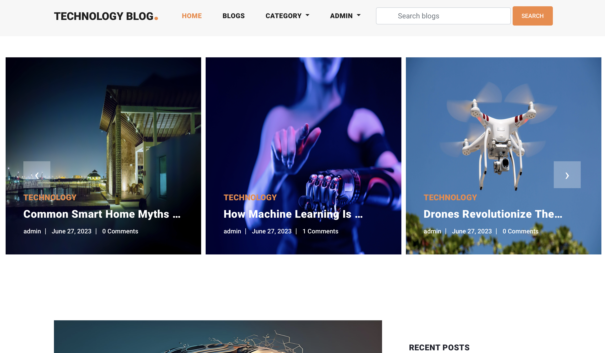
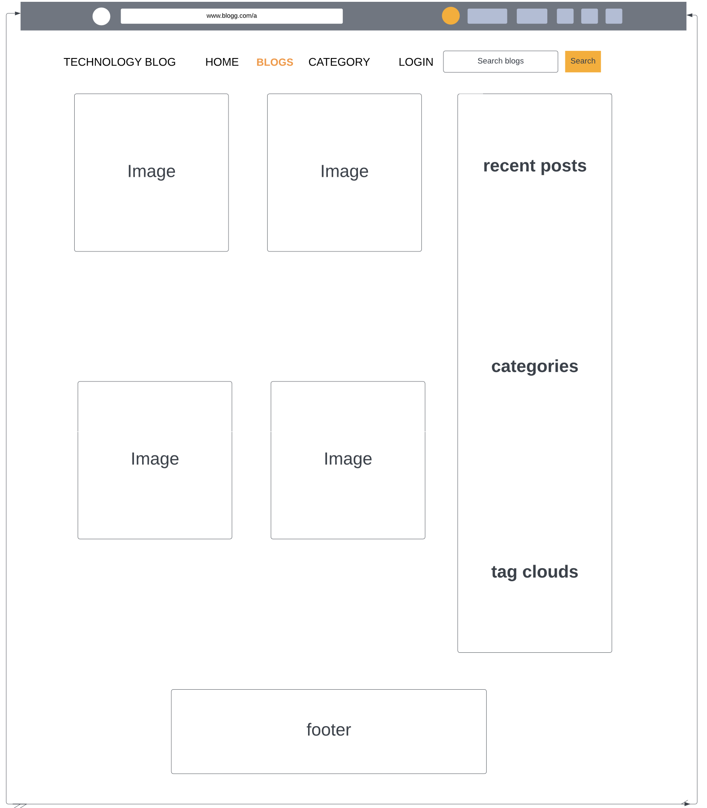
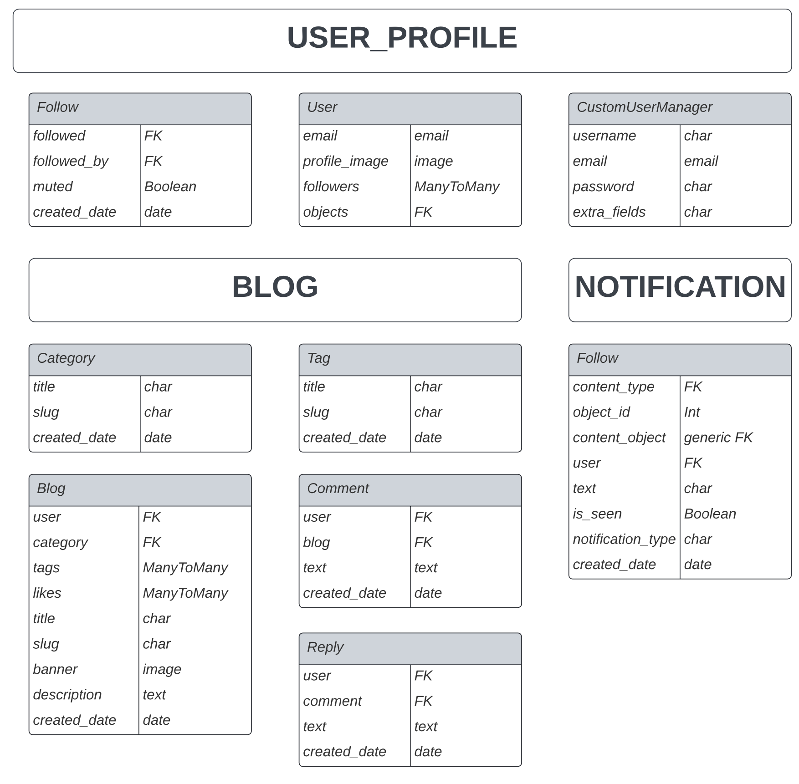
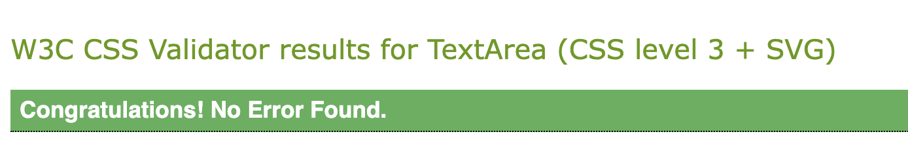
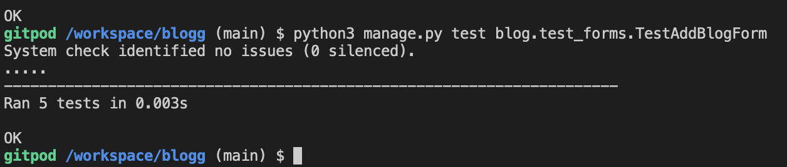
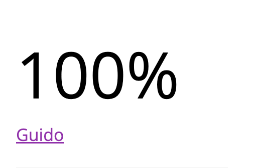
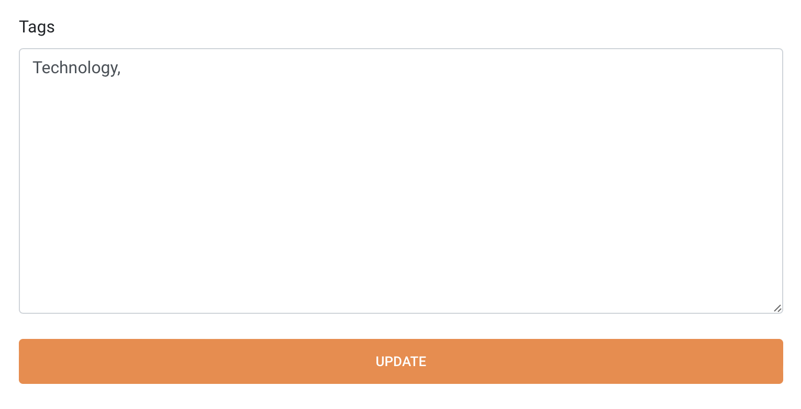

# Technology blog

Technology blog is a website/app that targets people who appreciate technology. This app is for technolgists who want to stay updated about latest technologies world wide. It allows users to have their own accounts or blogs, read and write their own posts and articles exclusively about technology and science, interact with other users by comments, likes or follows and share their common passion about up to date technology.



The live link for "Technology blog" can be found [HERE](https://bllog-30ebbac877ad.herokuapp.com/)

## Table of Contents

- [UX](#ux "UX")
  - [Site Purpose](#site-purpose "Site Purpose")
  - [Site Goal](#site-goal "Site Goal")
  - [Audience](#audience "Audience")
  - [Communication](#communication "Communication")
  - [Current User Goals](#current-user-goals "Current User Goals")
  - [New User Goals](#new-user-goals "New User Goals")
- [User Stories](#user-stories "User Stories")
- [Design](#design "Design")
  - [Colour Scheme](#colour-scheme "Colour Scheme")
  - [Typography](#typography "Typography")
  - [Imagery](#imagery "Imagery")
- [Features](#features "Features")
  - [Existing Features](#existing-features "Existing Features")
  - [C.R.U.D](#crud "C.R.U.D")
- [Testing](#testing "Testing")
  - [Validator Testing](#validator-testing "Validator Testing")
  - [Unfixed Bugs](#unfixed-bugs "Unfixed Bugs")
- [Technologies Used](#technologies-used "Technologies Used")
  - [Main Languages Used](#main-languages-used "Main Languages Used")
  - [Frameworks, Libraries & Programs Used](#frameworks-libraries-programs-used "Frameworks, Libraries & Programs Used")
- [Deployment](#deployment "Deployment")
- [Credits](#credits "Credits")
  - [Content](#content "Content")
  - [Media](#media "Media")

## UX

### Site Purpose:

The intent of the site is to bring technologists together. [“Technology blog”](https://bllog-30ebbac877ad.herokuapp.com/) Is an online technology network platform where site users can stay up to date with anything related to technology.

### Site Goal:

To build a platform that allows technology lovers to find all what they want to know about latest cutting edge technologies world wide whether by reading posts or writting posts as well.

### Audience:

For anyone who have a passion for technology in their lives. This website have no restrictions at all over user age.

### Communication:
With a clean, easy to follow layout, the user - both writers and readers alike - are guided through the features of the website with an ease of navigation.

### Current User Goals:
- To allow users or bloggers to easily be able to create their own profiles, post their articles and posts to the technology world, view all their posts, edit, update them and delete them.
- To view all the available technology posts, articles and blogs created by bloggers both on their profile page, and by clicking on the blogger name when viewing a technology post, category or tag. 
- Interact with other bloggers (by comments, likes, follows) and stay up to date with the technlogy world.
- To receive a notification with every single follow, comment or like with an additonal feature to mute the notifications.
- To search posts using key words in the website using the search box feature.
- To filter the posts in the website by categories, tag clouds and users.
- to see the recent and latest posts.
- to see any related posts when you open any post.
- to see the total number of posts at the top of blogs page.

### Future Goals:

- To linke the notification system with the provided email addresses by the users for any new posts, likes or comments
- To share any posts with other users at facebook, twitter and social media.
- To create a commercial side for the website or the app connecting with technology institutes, universities, companies, and organizations that might have an interest to post ads for related courses, jobs and events at the website. Moreover, add a monthly and yearly subscriptions plans.

## User Stories
All stories have been implemented.

USER STORY: Crud operation on blogs 
1. As a **site user and admin** I can **I can view a list of posts** so that **I can create, read, update and delete them**
USER STORY: Create Custom user model
2. As a **admin** I can **create a database in django** so that **I can apply CRUD operation on it**
USER STORY: Registration/Authentication through username
3. As a **Site User/Admin** I can **I can register an account** so that **I can have my own blog**
USER STORY: Registration/Authentication through email
4. As a **Site User/Admin** I can **register an account** so that **I can have my own blog**
USER STORY: Personal profile management
5. As a **Site User** I can **have and manage my personal profile** so that **I can update it, see my own blogs and have a full control on it**
USER STORY: Filter blogs by different criteria (title, category, tags)
6. As a **Site User** I can **filter blogs by different criteria** so that **I can easily find my preferences**
USER STORY: Search blogs by different criteria
7. As a **Site User** I can **search blogs by different criteria** so that **I reach easily to my preferred blogs**
USER STORY: Like blogs
8. As a **Site User** I can **like blogs** so that **I can interact with the content**
USER STORY: Comment and replies on blogs
9. As a **Site User** I can **comment and reply on blogs** so that **I can interact with others in the website**
USER STORY: Follow and unfollow other users
10. As a **Site User** I can **follow and unfollow other user** so that **I can keep myself posted about my favorite users**
USER STORY: Implementing generic relations
11. As a  **site user** I can  **receive notifications when someone post, comment, like or follow me**  so that  **I can stay connected**
USER STORY: Notification system
12. As a **Site User** I can **receive notifications when users like or write comments** so that **I can interact with other users**
USER STORY: Mute/unmute notifications
13. As a **Site User** I can **mute and unmute notifications** so that **I can be selective over my notifications preferences**
USER STORY: Deployment on Heroku
14. As a **Admin** I can **deploy my blog project** so that **other users can access it**
USER STORY: Models Creation
15. As an **Admin** I can **create categories, tags, blogs, comments, replies posts** so that **I can admin them in Django database**
USER STORY: Site Pagination
16. As a **Site USer** I can **view a paginated list of posts** so that **easily select a post to view**
USER STORY: View Others Profile
17. As a **Site user** I can **view others profile** so that **I can see the number of posts, posts, following and followers number**

## Design

### Wireframes:

##### Home Page: 


##### Blogs Page:



### Database Schema



### Colour Scheme:


### Typography:
All fonts were obtained from fonts.googleapis (Ready to use template):
1. Roboto:100,100i,300,300i,400,400i,500,500i,700,700i,900,900i
2. Fontawesome
3. flexslider-icon for the slider of images at the home page

### Imagery:
- All photography for the fictional blogs were downloaded from pexel and unsplash website.

## Features

### Existing Features:

#### Home Page:


#### Navigation Bar:

##### Desktop:


##### Mobile:


#### About Page:


#### Prints Page:


#### Print Details Page:


#### Blog Page:


#### Blog Post Details:


#### Log in, Log out & Sign up:

##### Login:


##### Logout:


##### Sign-up:


#### Social Links:


### C.R.U.D:

#### Create (button):
- The button to invite you to submit a new artwork will be found on the **"Prints"** page.
- It is only visible to users who are signed in.


#### Create (form):
- This page may only be accessed from the button on the **"Prints"** page.


#### Read:


#### Update & Delete:
- The update & delete feature is only available to the user who who directly submitted the artwork.


### Features Left to Implement
- Online shop
- Artist profiles
- Contact page
- Password reset
- Social media sign-in

## Testing
1. index.html page not loading:
 - Through trial and error, I changed the view code from a class to a function.
 - as well as removed the ```.as_view()``` from the URL path.

2. CSS styles not loading on blog page:
 - This [Django tutorial](https://docs.djangoproject.com/en/4.0/intro/tutorial06/) indicated that the styles were incorrectly linked.
 - This was resolved updating the href link in the base.html to ``````

3. Error message after installing Allauth:
 - Tutor support informed me that Heroku had updated my database url value.
 - This was resolved by updating the env.py file with the new URL.

4. Invalid "syntax" error after installing **crispy-forms**:
 - A comma was missing from within the BlogPostPage class.

5. Django error message after adding comment form:
 - CSRF token had been added as CRSF.
 - Correcting the error resolved the issue.

6. Console error after adding "Categories" field to Artprints model:
 - The console indicated that a default field had not been supplied.
 - As I did not remember that it would need to be an integer, I added ```default='undecided'``` to the field.
 - This produced further error messages.
 - I corrected the model, and attempted to migrate the changes once more. The same error continued to display on the console.
 - I looked up how to revert the migrations on [Stackoverflow](https://stackoverflow.com/questions/32123477/how-to-revert-the-last-migration) using the following command: ```./manage.py migrate artprints zero```, but this did not resolve the issue.
 - After consulting with a fellow student who had experienced something similar, [Mats Simonsson](https://github.com/Pelikantapeten), I then deleted the files out of the migrations folder within my app folder.
 - This resolved this issue.
 - However upon contemplation, I have understood that had the database been significantly populated with data, this would not be a reasonable approach to take, as it would eliminate important information.

7. URL paths for second app:
 - Being unable to submit an empty string as the first parameter in the main URLs folder, my weblink was displaying as **prints/prints/**.
 - Having tried multiple suggestions from numerous sources, I instead resorted to changing the main URL path to **art** so that any new URL path created in the second app file, would then display as **art/pathname**
 - This is not the resolution that I was looking for, however for aesthetics, I have accepted it as the solution for now.

8. Hero & About image not loading on deployed site:
 - These two images were stored directly within the django app as opposed to being uploaded to Cloudinary.
 - I tried numerous articles that suggested to change the URL path linked in the CSS file, and tried the following:
  - ```background: url(/static/images/gallery-wall.jpg) no-repeat;``` : As shown in [Simpleit](https://simpleit.rocks/python/django/call-static-templatetag-for-background-image-in-css/)
  - ```background: url('') no-repeat;``` : As showing in [Stackoverflow](https://stackoverflow.com/questions/5898776/how-to-refer-to-static-files-in-my-css-files)
  - ```background: url('') no-repeat;```
  - ```background: url("{{ STATIC_URL }}images/gallery-wall.jpg") no-repeat;```
  - ```background: url(static("images/gallery-wall.jpg"));```
 - As none of these resolved the issue, and I was unable to ascertain the solution that I required, I instead resorted to loading the images directly into the HTML files as opposed to the CSS. 
 - Issue resolved.

9. Art submission form unable to complete:
 - Terminal error suggested no file was selected.
 - I read numerous articles on stackoverflow, cloudinary, comments on slack, and was unable to resolve this.
 - Ger from Tutor support indicated that the required field was missing from my form tags ```enctype="multipart/form-data```
 - Adding this resolved the issue.

10. User unable to submit multiple prints:
 - This was due to the slug field not being included in the form submission.
 - Another side effect of this, is that when the print was then approved via the admin panel, should the admin not pay attention and approve it without inserting a slug, the entire prints page would then fail to load.
 - To resolve this, the slug field was added to the form field.
 - Have not yet figured out how to have this auto-populate as it would were it submitted directly from the admin panel.
 - However, adding the slug field ensures that the "Create" feature of CRUD now works as intended.

11. Blog post page pushes social links to left:
 - Upon inspection in dev tools, the row containing the comments was being duplicated, causing the layout to shift.
 - Issue resolved by moving the `````` inside of the closing div for the row.
 - This then caused an issue with the view when the user was logged out.
 - Once more, the opening & closing if statements needed to be moved outside the row entirely.

12. Submit multiple comments:
- Due to how the comments section was set up in the html file, upon submission of a comment, regardless of approval, the form would no longer be available to the user. Instead, a display message was constantly shown, suggesting that the comment was still pending approval, even if it had been approved.
- To resolve this, the section in the HTML was removed, and instead a line was added to the view function so that a success message would display on the screen after submission. This then allows the user to go and submit multiple comments on the same post, regardless of whether they have an approved or pending comment already submitted.

13. Testing CRUD functionality:
 - Each of the features were tested multiple times to ensure that numerous new posts could be submitted, and that each post had the ability to be updated and edited by the user that submitted it.
 - If a post is submitted by another user, the edit/delete buttons do not appear on the page.

14. Forms test failed to run:
 - When running the newly created test in forms.py, the following error occurred in the terminal: "Got an error creating the test database: permission denied to create database".
 - A [Slack comment](https://code-institute-room.slack.com/archives/C026PTF46F5/p1647428298841409?thread_ts=1647427231.501879&cid=C026PTF46F5) provided the answer for this, & suggested that the new DATABASES variable in the settings.py file needed to be commented out, and the original one to be made active again for the tests to work.
 - Following these steps allowed the test to perform as expected.

15. AssertionError: 301 != 200:
 - The second test implemented from the "Hello Django" project failed each time it was ran.
 - The answer on how to resolve it was ascertained from [Stackoverflow](https://stackoverflow.com/questions/21215035/django-test-always-returning-301), and adding an ```follow=True``` to the code in turn caused the tests to pass.


### Validator Testing
- html files pass through the [W3C validator](https://validator.w3.org/) with no html issues found
- Errors listed only reference  & {{}} tags.

- CSS files pass through the [Jigsaw validator](https://jigsaw.w3.org/css-validator/) with no issues found.



- An automated test has been conducted successfully for the python forms of the blog


- page has an excellent Accessibility rating in Lighthouse


- Python files passed through [PEP8 Online](https://www.pythonchecker.com/) with no issues found.



- Tested the site opens in Chrome & Safari without issues.
- All links open to external pages as intended.

### Unfixed Bugs
- I couldn't fix a bug with the Tag field (many to many field). I can add and update as much tags I want but when I try to delete and exist tags it doesn't reflect when I update the blog.


## Technologies Used
### Main Languages Used
- HTML5
- CSS3
- Javascript
- jQuery
- Python
- Django
- SQL - Postgres
- Jquery


### Installed Packages:
- 'django<4' gunicorn
- dj_database_url psycopg2
- dj3-cloudinary-storage
- Pillow
- django-summernote [(link)](https://summernote.org/)


## Deployment
The site was deployed to Heroku. The steps to deploy are as follows:
- Install Django & Gunicorn:
```pip3 install 'django<4' gunicorn```
- Install Django database & psycopg:
```pip3 install dj_database_url psycopg2```
- Install Cloudinary:
```pip3 install dj3-cloudinary-storage```
- Creating the requirements.txt file with the following command:
```pip3 freeze --local > requirements.txt```
- a django project was created using:
```django-admin startproject blog_website .```
- the blog app was then created with:
```python3 manage.py startapp blog```
- which was then added to the settings.py file within our project directory along with django_summernote, user_profile and notification.
- the changes were then migrated using:
```python3 manage.py migrate```
- navigated to [Heroku](www.heroku.com) & created a new app called bllog.
- added the Heroku Postgres database to the Resources tab.
- navigated to the Settings Tab, to add the following key/value pairs to the configvars:
1. key: SECRET_KEY | value: randomkey
2. key: PORT | value: 8000
3. key: CLOUDINARY_URL | value: API environment variable
4. key: DATABASE_URL | value: ElephantSQL database UR
- added the DATABASE_URL, SECRET_KEY & CLOUDINARY_URL to the env.py file
- added the DATABASE_URL, SECRET_KEY & CLOUDINARY_URL to the settings.py file
- added X_FRAME_OPTIONS = 'SAMEORIGIN' to the settings.py (for summernote)
- add an import os statement for the env.py file.
- added Heroku and the localhost to the ALLOWED_HOSTS in settings.py
- created the Procfile
- pushed the project to Github
- connected my github account to Heroku through the Deploy tab
- connected my github project repository, and then clicked on the "Deploy" button

