# Technology blog

Technology blog is a website/app that targets people who appreciate technology. This app is for technolgists who want to stay updated about latest technologies world wide. It allows users to have their own accounts or blogs, read and write their own posts and articles exclusively about technology and science, interact with other users by comments, likes or follows and share their common passion about up to date technology.


The live link for "Technology blog" can be found [HERE](https://bllog-30ebbac877ad.herokuapp.com/)

## Table of Contents

- [UX](#ux "UX")
  - [Site Purpose](#site-purpose "Site Purpose")
  - [Site Goal](#site-goal "Site Goal")
  - [Audience](#audience "Audience")
  - [Communication](#communication "Communication")
  - [Current User Goals](#current-user-goals "Current User Goals")
  - [Future Goals](#future-goals "Future Goals")
- [User Stories](#user-stories "User Stories")
- [Design](#design "Design")
  - [Colour Scheme](#colour-scheme "Colour Scheme")
  - [Typography](#typography "Typography")
  - [Imagery](#imagery "Imagery")
- [Features](#features "Features")
  - [Existing Features](#existing-features "Existing Features")
- [Testing](#testing "Testing")
  - [Fixed Bugs](#fixed-bugs "Fixed Bugs")
  - [Validator Testing](#validator-testing "Validator Testing")
  - [Lighthouse Testing](#Lighthouse-testing "Lighthouse Testing")
  - [Unfixed Bugs](#unfixed-bugs "Unfixed Bugs")
- [Technologies Used](#technologies-used "Technologies Used")
  - [Main Languages Used](#main-languages-used "Main Languages Used")
  - [Installed Packages:](#installed-packages "Installed Packages:")
- [Deployment](#deployment "Deployment")
- [Credits](#credits "Credits")

## UX

### Site Purpose:

The intent of the site is to bring technologists together. [“Technology blog”](https://bllog-30ebbac877ad.herokuapp.com/) Is an online technology network platform where site users can stay up to date with anything related to technology.

### Site Goal:

To build a platform that allows technology lovers to find all what they want to know about latest cutting edge technologies world wide whether by reading posts or writting posts as well.

### Audience:

For anyone who have a passion for technology in their lives. This website have no restrictions at all over user age.

### Communication:

With a clean, easy to follow layout, the user - both writers and readers alike - are guided through the features of the website with an ease of navigation.

### Current User Goals:

- To allow users or bloggers to easily be able to create their own profiles, post their articles and posts to the technology world, view all their posts, edit, update them and delete them.
- To view all the available technology posts, articles and blogs created by bloggers both on their profile page, and by clicking on the blogger name when viewing a technology post, category or tag. 
- Interact with other bloggers (by comments, likes, follows) and stay up to date with the technlogy world.
- To receive a notification with every single follow, comment or like with an additonal feature to mute the notifications.
- To search posts using key words in the website using the search box feature.
- To filter the posts in the website by categories, tag clouds and users.
- to see the recent and latest posts.
- to see any related posts when you open any post.
- to see the total number of posts at the top of blogs page.

### Future Goals:

- To linke the notification system with the provided email addresses by the users for any new posts, likes or comments
- To share any posts with other users at facebook, twitter and social media.
- To create a commercial side for the website or the app connecting with technology institutes, universities, companies, and organizations that might have an interest to post ads for related courses, jobs and events at the website. Moreover, add a monthly and yearly subscriptions plans.

## User Stories

All stories have been implemented.

USER STORY: Crud operation on blogs 
1. As a **site user and admin** I can **I can view a list of posts** so that **I can create, read, update and delete them**
USER STORY: Create Custom user model
2. As a **admin** I can **create a database in django** so that **I can apply CRUD operation on it**
USER STORY: Registration/Authentication through username
3. As a **Site User/Admin** I can **I can register an account** so that **I can have my own blog**
USER STORY: Registration/Authentication through email
4. As a **Site User/Admin** I can **register an account** so that **I can have my own blog**
USER STORY: Personal profile management
5. As a **Site User** I can **have and manage my personal profile** so that **I can update it, see my own blogs and have a full control on it**
USER STORY: Filter blogs by different criteria (title, category, tags)
6. As a **Site User** I can **filter blogs by different criteria** so that **I can easily find my preferences**
USER STORY: Search blogs by different criteria
7. As a **Site User** I can **search blogs by different criteria** so that **I reach easily to my preferred blogs**
USER STORY: Like blogs
8. As a **Site User** I can **like blogs** so that **I can interact with the content**
USER STORY: Comment and replies on blogs
9. As a **Site User** I can **comment and reply on blogs** so that **I can interact with others in the website**
USER STORY: Follow and unfollow other users
10. As a **Site User** I can **follow and unfollow other user** so that **I can keep myself posted about my favorite users**
USER STORY: Implementing generic relations
11. As a  **site user** I can  **receive notifications when someone post, comment, like or follow me**  so that  **I can stay connected**
USER STORY: Notification system
12. As a **Site User** I can **receive notifications when users like or write comments** so that **I can interact with other users**
USER STORY: Mute/unmute notifications
13. As a **Site User** I can **mute and unmute notifications** so that **I can be selective over my notifications preferences**
USER STORY: Deployment on Heroku
14. As a **Admin** I can **deploy my blog project** so that **other users can access it**
USER STORY: Models Creation
15. As an **Admin** I can **create categories, tags, blogs, comments, replies posts** so that **I can admin them in Django database**
USER STORY: Site Pagination
16. As a **Site USer** I can **view a paginated list of posts** so that **easily select a post to view**
USER STORY: View Others Profile
17. As a **Site user** I can **view others profile** so that **I can see the number of posts, posts, following and followers number**

## Design
### Wireframes:

#### Home Page: 

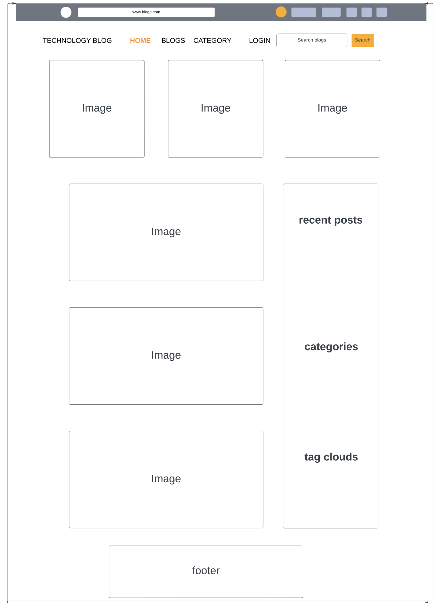

#### Blogs Page:


#### Database Schema


#### Colour Scheme:


### Typography:

All fonts were obtained from fonts.googleapis (Ready to use template):
1. Roboto:100,100i,300,300i,400,400i,500,500i,700,700i,900,900i
2. Fontawesome
3. flexslider-icon for the slider of images at the home page

### Imagery:

- All photography for the fictional blogs were downloaded from pexel and unsplash website.

## Features
### Existing Features:

#### Blogs Page:

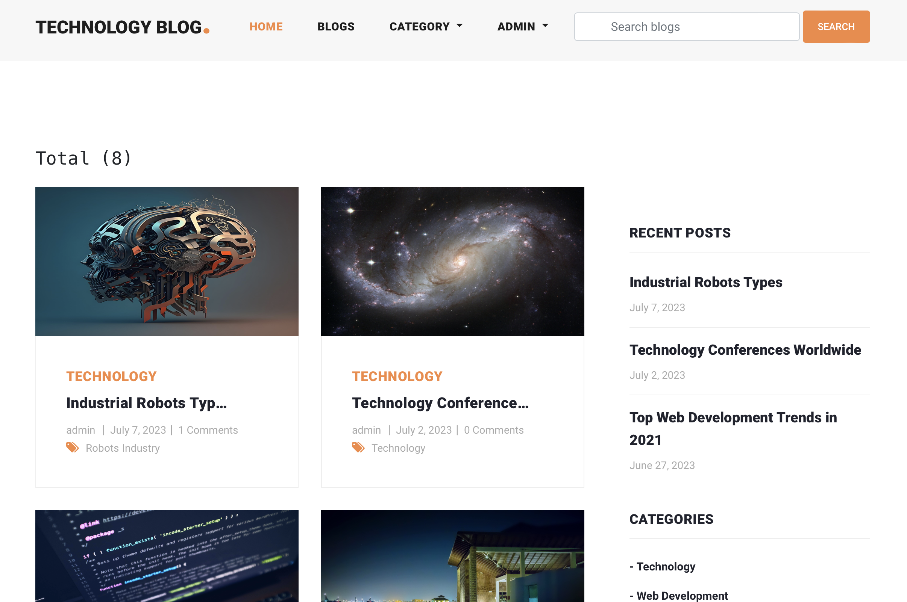

#### Category Page:

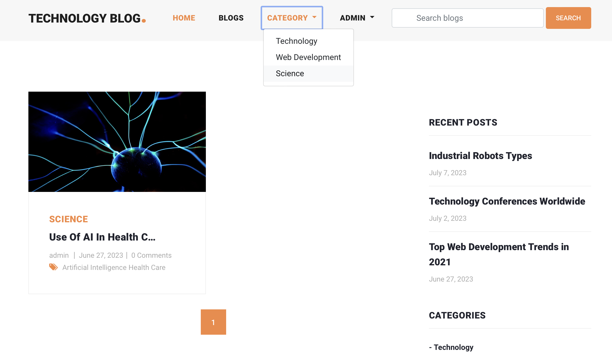

#### My Profile Page:

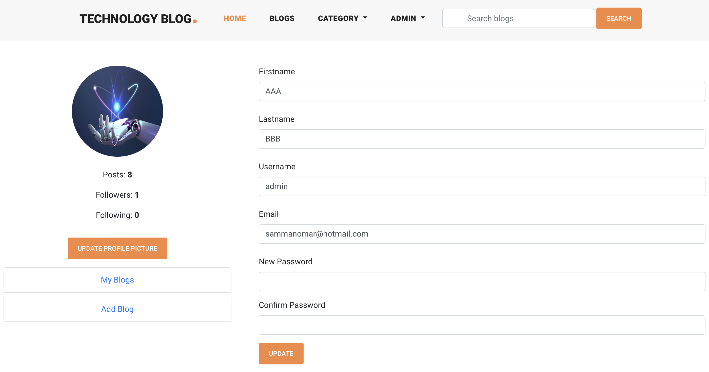

#### User Profile Page:

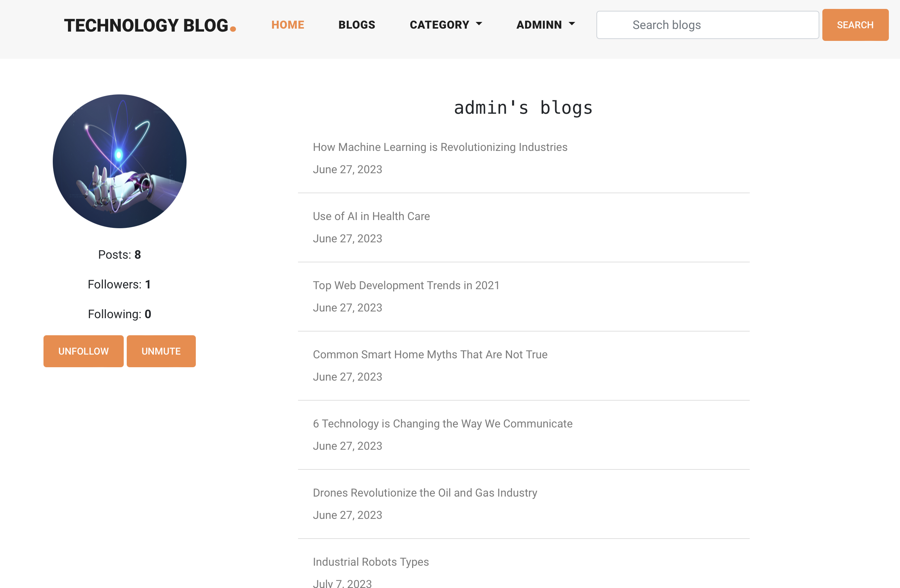

#### My Blogs Page:


#### Add Blog Page:

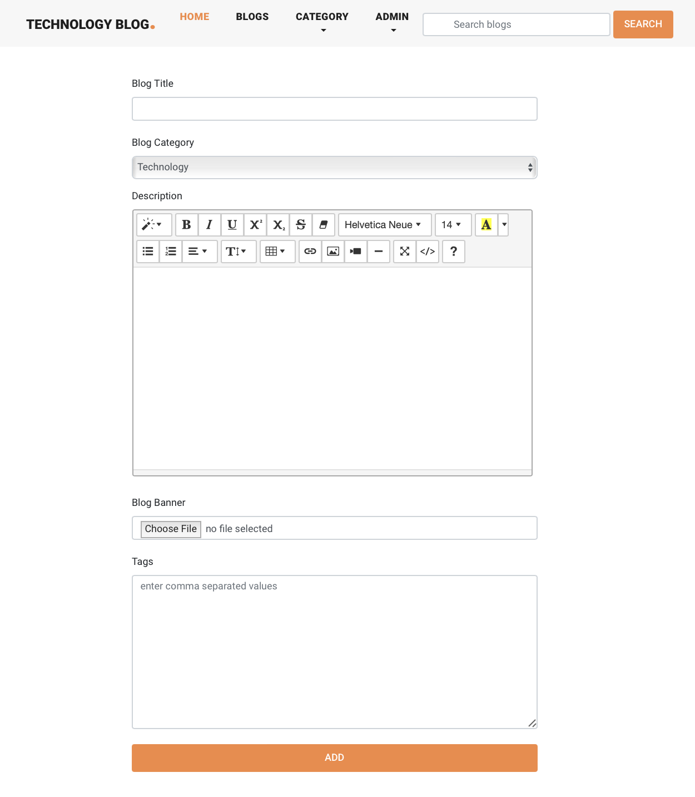

#### Edit Blog Page:

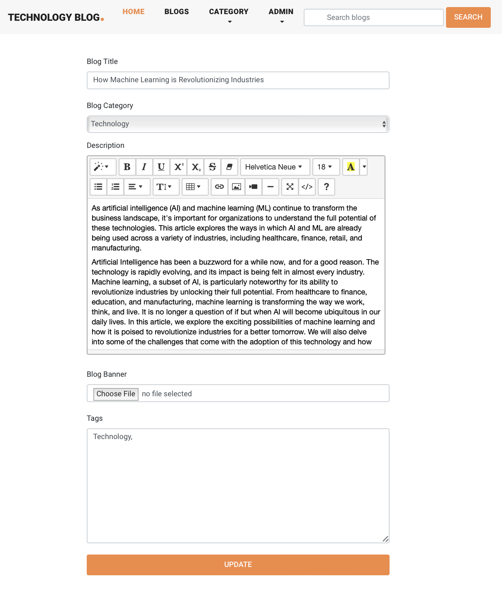

#### Notifications Page:

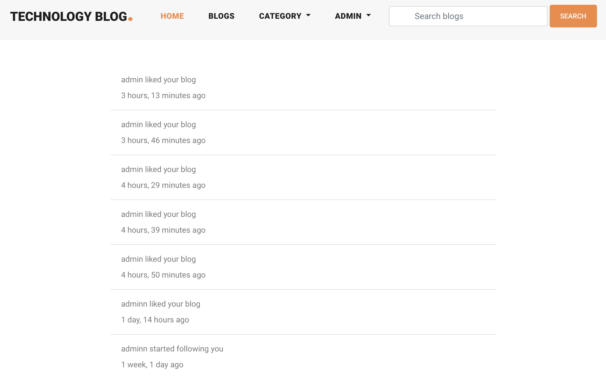

#### Login/Logout Page:

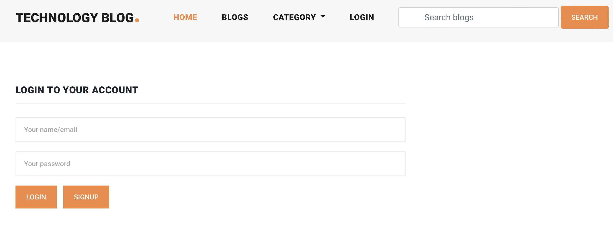

#### Signup Page:

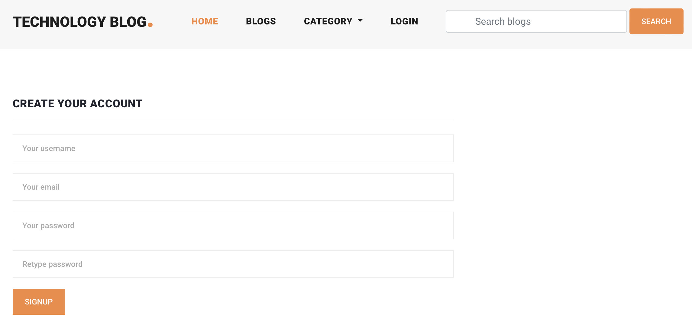

#### Search Page:

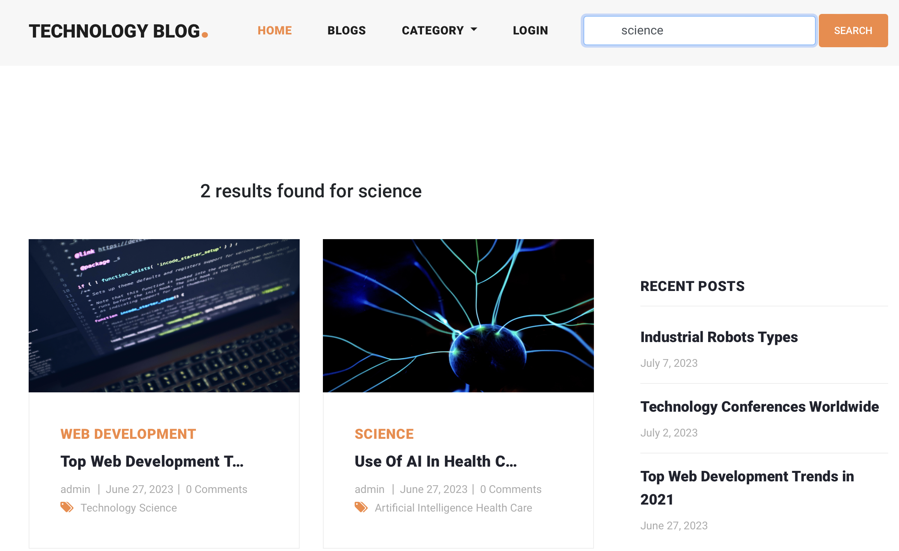

### Features Left to Implement
- Commerical side
- Social media sharing

## Testing
### Fixed Bugs

1. Login.html/logut.html pages not loading:
 - It was solved through tutor support. It turned out that ‘login/’ and 'logout/' urls are reserved by codeanywhere and can’t be used. 
 - I had to change the paths in the urls.py file to ‘blog_login/’ and 'blog_logout instead of ‘login/’ 'logout/'.

2. Unsuccessful Deployment:
 - This happened because of not removing the DISABLE_COLLECTSTATIC before the deployment.
 - It was solved with tutor support by creating a DEBUG variable DEBUG = os.environ.get("DEBUG") and updating the env.py with that variable

3. Django error db migrations exceptions InconsistentMigrationHistory:
- This happened after I created the new user_profile app. I couldn't make the migrations after coding the models.
- Tutor support helped me step by step to reset and wipe out the database. I started clean again with a new migrations and problem solved.

4. Unsuccessful capture for the correct category field after being added and selected by the user:
 - My line of code was correct. Tutor support couldn't figure it out as well.
 - This was resolved spontaneously when I switched to Gitpod after I ran out of credit at codeanywhere. It was a problem with codeanywhere platform itself. Gitpod didn't raise any error with the same code.

5. Unable to reflect any update to the tag field in update_blog template:
 - Tutor support helped with this by looping and targeting the blog tag instead of the blog tag instance in the form.

6. CKeditor doesn't load on heroku deployed site :
 - Tutor support adviced me to uninstall the CKeditor and replace it with Summernote.
 - I uninstalled CKeditor and insalled Summernote carefully as per the instructions. 
 - A bigger technical issue has popped up : "django.db.migrations.exceptions.NodeNotFoundError: Migration blog.0003_alter_blog_description dependencies reference nonexistent parent node" ('blog', '0002_alter_blog_description')
 - It was solve by creating a json file containing my current data:
   python3 manage.py dumpdata --exclude auth.permission --exclude contenttypes > db.json. I had to delete migrations 0002 and 0003 from the blog/migrations folder. Then run python3 manage.py loaddata db.json. python manage.py loaddata users.json then python manage.py loaddata data.json. tutor support had to create 3 json files. Luckily I was able to load and restore my database again and make the migration again.
:
7. Error when I update the blog form after installing summernote 
- clean() got an unexpected keyword argument 'styles'
- Solved with the amazing support from Kasia the community content creator at CI. I had changed the version of summernote from django-summernote==0.8.20.0 to django-summernote==0.8.11.6 as per the walkthrough blog project and the run pip3 install -r requirements.txt. Problem solved.


### Validator Testing

- html files pass through the [W3C validator](https://validator.w3.org/) with no html issues found
- Errors listed only reference  & {{}} tags.

- CSS files pass through the [Jigsaw validator](https://jigsaw.w3.org/css-validator/) with no issues found.


- An automated test has been conducted successfully for the python forms of the blog


- Python files passed through [PEP8 Online](https://www.pythonchecker.com/) with no issues found.


### Lighthouse Testing

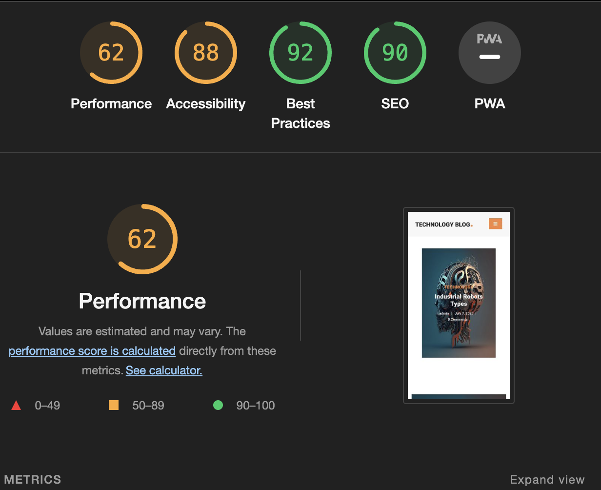

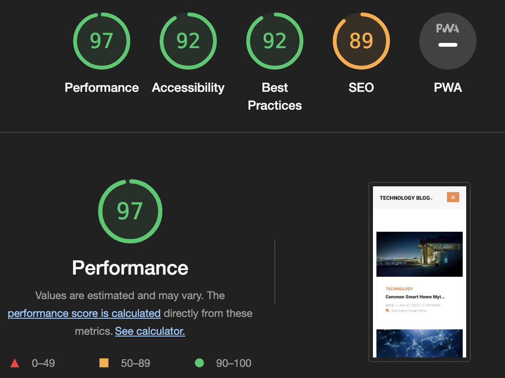


- Tested the site opens in Chrome & Safari without issues.
- All links open to external pages as intended.

### Unfixed Bugs
- I couldn't fix a bug with the Tag field (many to many field). I can add and update as much tags I want but when I try to delete an exist tags, it doesn't reflect when I update the blog.


## Technologies Used
### Main Languages Used

- HTML5
- CSS3
- Javascript
- jQuery
- Python
- Django
- SQL - Postgres
- jQuery


### Installed Packages:

- 'django<4' gunicorn
- dj_database_url psycopg2
- dj3-cloudinary-storage
- Pillow
- django-summernote [(link)](https://summernote.org/)


## Deployment

The site was deployed to Heroku. The steps to deploy are as follows:
- Install Django & Gunicorn:
```pip3 install 'django<4' gunicorn```
- Install Django database & psycopg:
```pip3 install dj_database_url psycopg2```
- Install Cloudinary:
```pip3 install dj3-cloudinary-storage```
- Creating the requirements.txt file with the following command:
```pip3 freeze --local > requirements.txt```
- a django project was created using:
```django-admin startproject blog_website .```
- the blog app was then created with:
```python3 manage.py startapp blog```
- which was then added to the settings.py file within our project directory along with django_summernote, user_profile and notification.
- the changes were then migrated using:
```python3 manage.py migrate```
- navigated to [Heroku](www.heroku.com) & created a new app called bllog.
- added the Heroku Postgres database to the Resources tab.
- navigated to the Settings Tab, to add the following key/value pairs to the configvars:
1. key: SECRET_KEY | value: randomkey
2. key: PORT | value: 8000
3. key: CLOUDINARY_URL | value: API environment variable
4. key: DATABASE_URL | value: ElephantSQL database UR
- added the DATABASE_URL, SECRET_KEY & CLOUDINARY_URL to the env.py file
- added the DATABASE_URL, SECRET_KEY & CLOUDINARY_URL to the settings.py file
- added X_FRAME_OPTIONS = 'SAMEORIGIN' to the settings.py (for summernote)
- add an import os statement for the env.py file.
- added Heroku and the localhost to the ALLOWED_HOSTS in settings.py
- created the Procfile
- pushed the project to Github
- connected my github account to Heroku through the Deploy tab
- connected my github project repository, and then clicked on the "Deploy" button


## Credits

- https://templatemo.com/: A website that was the spark of my design for this website.
- https://www.articlesfactory.com/: All the articles of my project are taken from this website. It's a free to use website for all kind of articles with no copyright concerns.
- https://getbootstrap.com/docs/4.1/components/navbar/: I have used it for the navbar
- https://getbootstrap.com/docs/4.1/components/alerts/: I have used it for the alert messages
- The brilliant tutor support team (Joshua, Alan, Sean, Ed, Oisin, Gemma).
- The brlliant Kasia (the community content creator at CI)
- "I think therefore I blog" + "Hello Django" + Slack + Stackoverflow.
- Psychological support by my mentor Lauren Nicole.
- https://www.pexels.com/
- https://unsplash.com/
- https://www.freepik.com/


